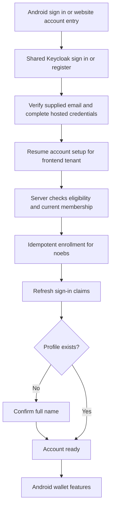

# Account enrollment for a caller-selected tenant

Every frontend uses the shared Keycloak signup and login flow. The frontend's
explicit deployment configuration selects one tenant. Android sends its build
tenant and the web account application sends its configured web tenant. There
is no tenant picker and signing up does not grant access to other tenants.

After the OAuth callback, use:

```http
GET /consumer/auth/context
Authorization: Bearer <access token>
X-Active-Tenant: noebs
```

If `enrollment_status` is `required` or `pending`, finish or resume enrollment:

```http
POST /consumer/auth/enrollment
Authorization: Bearer <access token>
X-Active-Tenant: noebs
Content-Type: application/json

{}
```

Both endpoints verify the same Keycloak issuer, audience, token lifetime and
explicit `noebs-mobile` or `noebs-web` client. They do not require an existing
tenant membership. A single canonical `X-Active-Tenant` is required, and it must
name a tenant in the repository's catalog. The server's enrollment policy then
decides whether this identity may join that particular tenant. The request body
never selects a subject, role or tenant.

```json
{
  "tenants": [{"id": "noebs", "name": "Noebs"}],
  "preferred_tenant_id": "noebs",
  "enrollment_status": "complete",
  "refresh_required": true,
  "suggested_fullname": "Example Person"
}
```

`tenants` contains only the selected tenant when its current Keycloak membership
has the `user` class; otherwise it is empty and `preferred_tenant_id` is null.
The latter field echoes the admitted caller selection; it is not an automatic
tenant-selection policy. `suggested_fullname` is an optional suggestion from the
authenticated owner's Keycloak profile. Let the person confirm it before
creating their application profile.

After successful POST, refresh OAuth tokens when `refresh_required` is true so
new Keycloak organization claims are available. Continue with the existing
tenant-scoped `GET /consumer/user` and, on `profile_required`, explicitly create
the profile with `POST /consumer/auth/profile`. Profile, KYC and wallet records
remain independent for each tenant. All existing protected APIs retain their
tenant membership and role requirements. The web account client is additionally
accepted only on profile creation and profile read, not the mobile wallet APIs.

Enrollment state belongs to `identity-auth`, in `account_enrollments` keyed by
issuer, subject and selected tenant. A PostgreSQL lock serializes simultaneous
retries for that identity and tenant. A pending receipt survives downstream
failure and can resume; a completed receipt is never replayed as a grant. If an
operator later revokes membership, context returns `complete` with no admitted
tenant, and repeating enrollment does not restore access. Existing operator
classes are preserved. Enrollment in a different tenant requires its own
explicit caller selection and policy decision.

Operator changes use the single [tenant access service](tenant-access.md): explicit
grant/revoke deltas, reviewed revision, stable operation ID and audit reason. The
legacy whole-set `assign-keycloak-memberships` write path is retired (dry-run
inspection remains available). An explicit user-role revoke atomically records a
completed enrollment receipt with its pending access intent, even for migrated
accounts that never acquired a signup receipt. Signup fails closed while an access
change or operator bootstrap is pending; the admin-only bootstrap operation marker
also covers a crash after native identity creation and before its subject is stored.
This prevents signup from restoring revoked user access or adding a user role to
an operator whose setup is only partially complete.

## Deployment policy and authority

Only `identity-auth` receives the dedicated `noebs-account-enroller` credential.
The gateway authenticates the account and signs its selected tenant, issuer,
subject, client, source address and token expiry with the existing workload
signature. Only the gateway has permission to call the two internal enrollment
routes. It supplies neither tenant roles nor an organization ID before admission.

Keycloak 26.7 requires `manage-organizations` and `manage-users` for native
organization/group membership changes. The dedicated enroller has exactly
these realm-management roles and no `realm-admin`. The signup adapter only reads
the account and adds organization/group membership. The explicit access adapter
uses the same scoped native authority for journaled group-role deltas; it does
not modify role definitions or group mappings. The ordinary reconciler
continues to own organization topology and roles.

The identity-auth runtime receives explicit policy, for example:

```yaml
account_enrollment:
  enabled: true
  issuer: https://api.noebs.sd/auth/realms/noebs
  tenant_ids: [noebs]
  allow_verified_accounts: true
  allowed_subjects: []
  allowed_verified_emails: []
  keycloak_base_url: https://keycloak.noebs.svc.cluster.local:8443/auth
  keycloak_client_id: noebs-account-enroller
  keycloak_client_secret: REPLACE_WITH_DEDICATED_SECRET
```

`tenant_ids` is an allowlist of enrollment destinations, not a list of grants.
New catalog tenants are not admitted automatically. Public verified-account
enrollment and the identity allowlists are mutually exclusive. When
`allow_verified_accounts` is false, only an explicitly listed subject or the
owner of an allowed Keycloak-verified email can enroll. Empty allowlists close
new enrollment. A phone-shaped username is not a verified email and is not
eligible for public verified-account enrollment on its own.

The gateway receives only `enabled` and the exact issuer. It never receives the
enroller credential. The identity-auth release also needs the existing Keycloak
transport CA and network access to internal Keycloak HTTPS. Migration
`identity_auth/005_account_enrollment.sql` must run before enabling the routes;
the runtime role can read/write progress but cannot delete completed receipts.

## Website account setup

The public website links to `/account/` on the API origin. The account application
uses `/account/login`, the same primary Keycloak browser flow, and
`/account/oauth/callback`, then continues at `/account/home`. It keeps tokens in
the server-side session. Enrollment and profile submissions require the secure
session and a valid CSRF token. The deployment's `web_tenant_id` supplies the
tenant; form fields, URL paths and query parameters cannot select another one.
This is the shared account setup experience, with no separate website credential
store or alternate tenant-enrollment flow.

Tests cover caller tenant isolation, no implicit or unknown tenant, policy
eligibility, resumed operations, preserved operator classes, revocation,
concurrent retries, signed transport of an unassigned principal, and the real
Keycloak enroller's permissions. Cross-browser email verification and Android
app links remain part of the client signup acceptance tests.


## Current signup flow

The production tenant catalog contains one tenant: `noebs` (Noebs). Android
selects it through `BuildConfig.TUTIPAY_TENANT_ID`; the website account service
selects it through `web_tenant_id`. Tenant identity remains explicit in the
protocol, so a later frontend can use another configured tenant without adding
a competing signup implementation.



Closing a tab or restarting the app resumes the same enrollment receipt and
profile. A revoked membership remains denied even when signup is retried.
The web account service finishes setup and links to Android; it does not create
a second wallet or store passwords.

The one-time tenant cutover preserves the existing issuer/subject, profile ID,
wallet IDs, balances and transaction records. Keycloak organization aliases are
immutable in version 26.7: create the replacement organization and copy the
existing user's membership class before removing the legacy membership. Preserve
the user itself, its credentials and its federation link. Retire only verified
empty legacy organizations after that transfer. The offline database cutover
requires reviewed manifests, application downtime and encrypted backups; it is
never run at application startup.

Mojaloop is a separate payment integration. Its participant ID is already
`noebs`; it is not an application tenant. Renaming the application tenant does
not create balances, seed participants or enable an SDK transport. Enable that
transport only against a deployed, verified external adapter.
